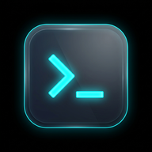

# 💻 terminalout

<p align="center">
  
</p>

<h3 align="center">terminalout</h3>

<p align="center">
  <strong>Acceso seguro a tu terminal local desde cualquier lugar</strong>
</p>

<p align="center">
  
  
  
  
</p>

---

**terminalout** es una herramienta ligera y segura que expone tu terminal local a la web de manera segura. Te permite interactuar con la consola de tu máquina desde tu teléfono móvil u otros dispositivos como si fuera una aplicación nativa (PWA), protegida mediante autenticación de dos factores (2FA/TOTP) y expuesta de forma segura a través de un túnel de Cloudflare con SSL.

## ✨ Características principales

- 🔒 **Seguridad con 2FA/TOTP**: Protege el acceso a tu terminal exigiendo un código temporal de 6 dígitos (compatible con Google Authenticator, Aegis, Authy, etc.).
- 🌐 **Túnel de Cloudflare Automático**: Genera de forma automática una URL pública con certificado SSL de confianza (`https://*.trycloudflare.com`). No requiere abrir puertos en el router ni configurar DNS.
- 📱 **Diseño optimizado para móviles (PWA)**: Se puede instalar en la pantalla de inicio de tu smartphone.
- ⌨️ **Barra de control móvil mejorada**:
  - **Doble Ctrl+C**: Botón para enviar un doble `SIGINT` (Ctrl+C rápido) para forzar la detención de procesos en ejecución.
  - **Portapapeles**: Botón para leer o pegar texto de forma rápida.
  - **Última Captura**: Acceso directo para ver/descargar la última captura de pantalla o foto tomada en tu computadora.
- 🎹 **Ajuste inteligente de Teclado**: Diseñado para que el teclado virtual de Android/iOS no tape la línea de comando ni los botones de control.

---

## 🚀 Instalación y Uso

### 1. Requisitos
- **Node.js** (v14 o superior)
- **ttyd** instalado en el sistema (`sudo apt install ttyd`)
- **cloudflared** (opcional, descargado automáticamente si no está presente)

### 2. Iniciar el Servidor
Para iniciar el servicio en segundo plano, simplemente ejecuta:
```bash
terminalout start -b
```

Al iniciar, se mostrará un banner en la consola con la dirección web local, la dirección de la red local (LAN) y la **dirección pública de Cloudflare** junto con sus respectivos códigos QR para escanear y abrir cómodamente desde tu teléfono.

### 3. Detener el Servidor
Para apagar el servidor y cerrar el túnel de Cloudflare de forma limpia:
```bash
terminalout stop
```

### 4. Consultar el Estado
Para ver si el servicio está activo, qué puertos usa, el secreto de configuración 2FA y las URLs activas:
```bash
terminalout status
```

---

## 🛠️ Configuración
La configuración se guarda en `~/.terminalout/config.json`. Puedes modificar parámetros como el puerto del proxy, el puerto de ttyd, y el tema visual utilizado para la terminal.

---

## 📄 Licencia
Este proyecto es libre y de código abierto bajo la licencia MIT.
